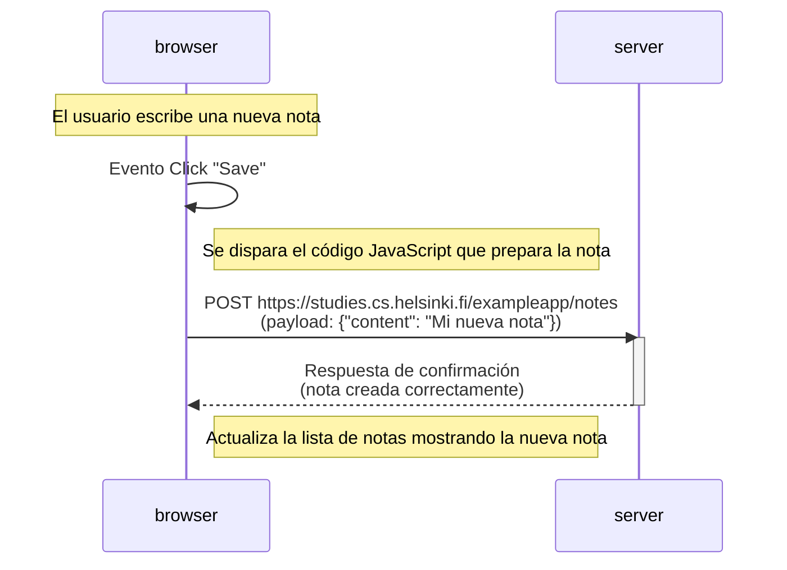

```mermaid
sequenceDiagram
    participant browser
    participant server
    %% A continuación se muestra la interacción para guardar una nota
    Note over browser: El usuario escribe una nueva nota
    browser->>browser: Evento Click "Save"
    Note right of browser: Se dispara el código JavaScript que prepara la nota
    browser->>server: POST https://studies.cs.helsinki.fi/exampleapp/notes<br/>(payload: {"content": "Mi nueva nota"})
    activate server
    server-->>browser: Respuesta de confirmación<br/>(nota creada correctamente)
    deactivate server
    Note right of browser: Actualiza la lista de notas mostrando la nueva nota
```

